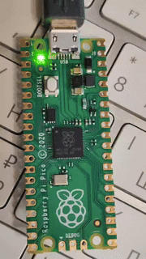

# Raspberry PI Pico 1 FreeRTOS Timer



## Introduction

This series of articles describes how to set up a development environment on macOS for developing FreeRTOS projects for the RP2040 with VSCode.

## Development Instructions

The instructions on preparing the environment on MacOS and building the project are written in the following two articles:

- [Development environment and prerequisites](Doc/Tag/Tag-00-Preparations.md);
- [Creation of the initial project](Doc/Tag/Tag-01-Project-Tepmlate.md).

## To build the project, run the following commands

Prepare the build directory (if it does not exist yet):

```bash
mkdir Src/build
```

Go to the build directory:

```bash
cd Src/build
```

Execute CMake:

```bash
cmake ..
```

Execute make:

```bash
make
```

---

**Note 1:** It was very helpful to read [this article](https://embeddedcomputing.com/technology/open-source/linux-freertos-related/using-freertos-with-the-raspberry-pi-pico) to start the project. It is the first consistent example I've found on the internet.

**Note 2:** Currently, this repository demonstrates only the toolchain configuration for the Pico-I development. For Pico 2, see [Raspberry PI Pico 2 FreeRTOS Timer](https://github.com/K-S-K/Pico-Timer-2), but it is not as descriptive as this project.
